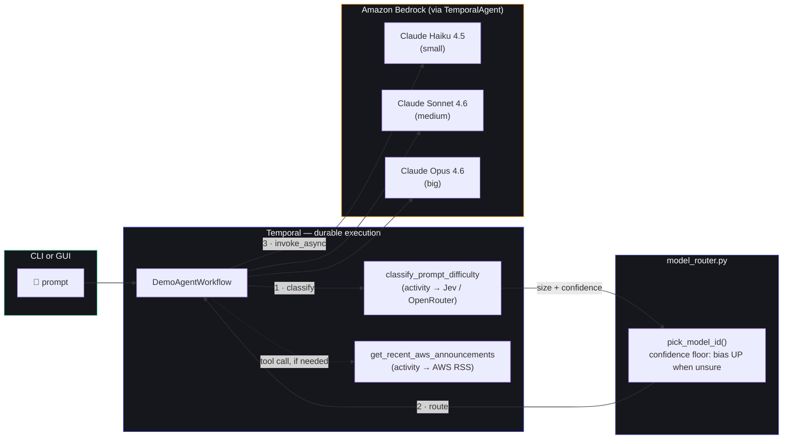
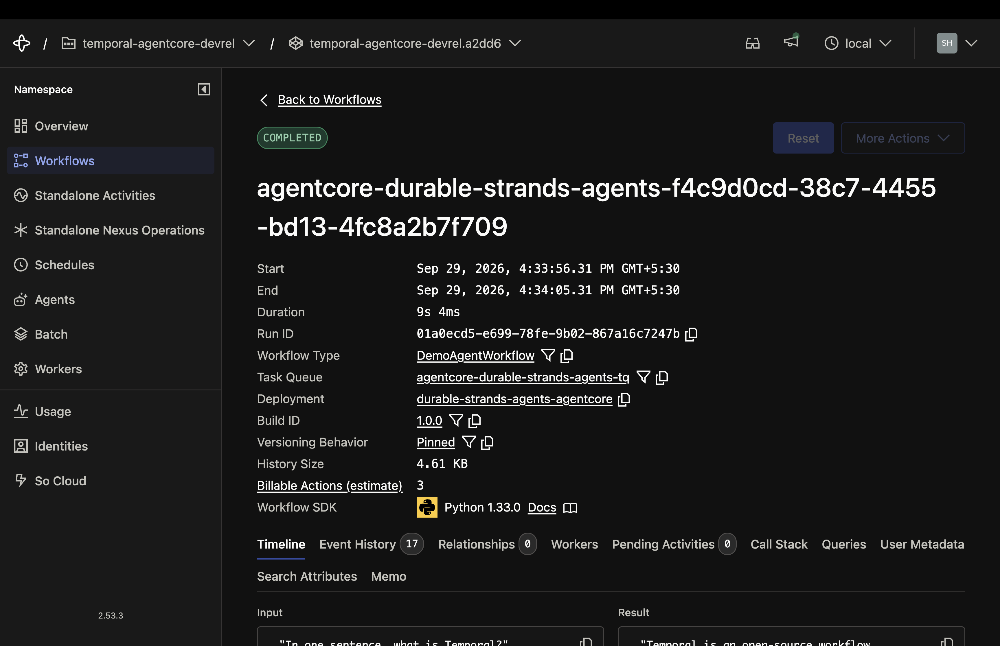
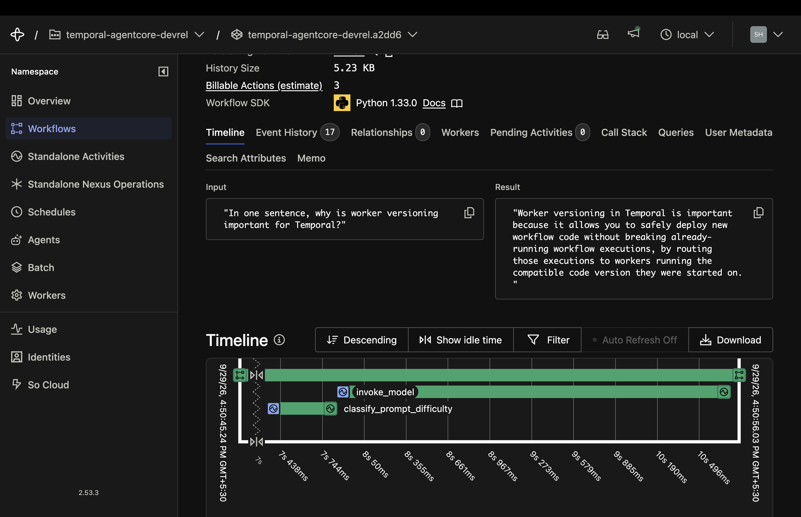
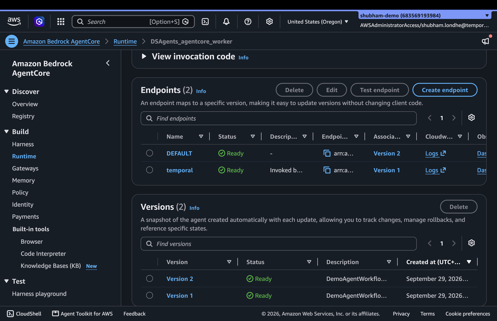

<div align="center">


# Durable Strands Agents

**A Strands AI agent, backed by Amazon Bedrock, running *durably* inside a Temporal workflow —**
**crash the worker mid-run, cut the network mid-call, and it still finishes without redoing work.**

Built for the AWS Community Day Colombo talk on durable AI agents.

[](https://temporal.io)
[](https://aws.amazon.com/bedrock/)
[](https://strandsagents.com)
[](https://typesafe.ai)
[](https://www.python.org)
[](https://docs.astral.sh/uv/)
[](#tests)

</div>

---

## What this is

Every prompt runs inside a single `DemoAgentWorkflow` — a Temporal workflow wrapping a Strands
`TemporalAgent`. Two things make it worth watching on stage:

- 🧠 **Jev-routed models** — [Jev](https://typesafe.ai) (TypeSafe's semantic classifier, called
  over OpenRouter) classifies each prompt as `small` / `medium` / `big` *before* the agent runs,
  and a deterministic policy resolves that to one of three Bedrock models. A trivial "hi" never
  pays Opus prices; a genuinely hard design question never gets shortchanged by Haiku.
- 💪 **Durable by construction** — kill the worker mid-run, restart it, and Temporal resumes
  exactly where it left off. Cut the network mid-call (a real kill-switch proxy, not a mock) and
  the workflow retries until it's restored — no lost work, no re-classification, no re-billing
  for a partial run.

<table>
<tr>
<td align="center" width="33%"><br/><sub>Idle console</sub></td>
<td align="center" width="33%"><br/><sub>Completed run &middot; live step feed</sub></td>
<td align="center" width="33%"><br/><sub>Network kill switch mid-outage</sub></td>
</tr>
</table>

## How a prompt actually flows



A **kill-switch proxy** (`proxy.py`) sits in front of both Bedrock and the AWS feed, so the
network-outage demo can sever either service independently — including tunnels already open —
without touching the worker process.

## The three tiers

| Jev label | Bedrock model | When it's picked |
|---|---|---|
| 🟢 `small` | Claude Haiku 4.5 | Greetings, quick facts, one-line rewrites |
| 🔵 `medium` | Claude Sonnet 4.6 | Everyday reasoning, explanations, routine coding |
| 🔴 `big` | Claude Opus 4.6 | Multi-step reasoning, tricky design, deep analysis — **also the safe fallback** if Jev's confidence is low or Jev itself is unreachable |

Jev only classifies — the label→model mapping and the confidence-floor safety net live in
plain, unit-tested Python (`model_router.py`), never inside the classifier itself.

## Run it

```bash
uv sync
cp .env.example .env   # AWS_REGION / credentials / OPENROUTER_API_KEY

temporal server start-dev                                          # terminal 1
uv run --env-file .env web.py                                      # terminal 2 — http://localhost:8090
HTTPS_PROXY=http://127.0.0.1:8899 \
HTTP_PROXY=http://127.0.0.1:8899 uv run --env-file .env worker.py  # terminal 3
```

> [!IMPORTANT]
> `--env-file .env` is required — `uv run` does **not** load `.env` on its own. Without it,
> `OPENROUTER_API_KEY` never gets set, every prompt's Jev classification fails over to the safe
> default, and every run silently uses the biggest (priciest) model regardless of actual
> difficulty.

Or skip the GUI and use the CLI:

```bash
uv run --env-file .env cli.py "What's new in Bedrock?"
```

Requires Bedrock model access enabled in your AWS account/region, and an OpenRouter API key
for Jev — get one at [openrouter.ai/keys](https://openrouter.ai/keys).

## Demo the durability

- 🔌 **Worker crash** — send a prompt, `Ctrl+C` the worker mid-run, restart it with the same env
  vars. The workflow resumes instead of starting over.
- 🌐 **Network outage** — click **Network** in the GUI, hit **Cut network** mid-run, watch it
  retry, then **Restore network**. It completes without touching the worker at all.
- 🎯 **Model routing** — try a greeting, a routine coding question, and a deliberately hard
  multi-step design prompt back to back. Watch the tier badge move `small → medium → big` and
  the reasoning quality scale with it.

## Running on Amazon Bedrock AgentCore

The same `DemoAgentWorkflow` also runs as a [Temporal Serverless
Worker](https://docs.temporal.io/serverless-workers) hosted inside an [Amazon Bedrock AgentCore
Runtime](https://docs.aws.amazon.com/bedrock-agentcore/latest/devguide/runtime.html) session —
scale-to-zero compute instead of an always-on `worker.py` process. This is a **separate
deployment target**, not a replacement for the local demo: the network kill-switch (`proxy.py`)
has no equivalent inside AgentCore's managed sandbox and is out of scope there.

<table>
<tr>
<td align="center" width="33%"><br/><sub>Temporal Cloud &middot; completed workflow</sub></td>
<td align="center" width="33%"><br/><sub>Timeline &middot; classify &rarr; invoke_model Activities</sub></td>
<td align="center" width="33%"><br/><sub>AWS console &middot; AgentCore Runtime, endpoint Ready</sub></td>
</tr>
</table>

Adapted from Temporal's own reference sample
([`temporalio/samples-python#360`](https://github.com/temporalio/samples-python/pull/360),
`bedrock_agentcore/strands_agent/`) — `agentcore_worker.py` follows that pattern exactly:

- `BedrockAgentCoreApp` (`bedrock-agentcore` SDK) supplies the `/ping` + `/invocations` HTTP
  contract AgentCore Runtime expects.
- `@app.entrypoint` starts the Temporal `Worker` as a background async task and acknowledges
  immediately — it does **not** hold the request open for the whole polling session.
- An `ActivityTracker` interceptor keeps the session `HealthyBusy` while any Activity (a Bedrock
  call or the RSS tool) is in flight, and only lets the Worker drain and exit after
  `AGENTCORE_DEBOUNCE_SECONDS` of true idleness — otherwise AgentCore's idle timer could reclaim
  the session mid-turn.
- `Worker` requires `WorkerDeploymentConfig` with `use_worker_versioning=True` and explicit
  `TEMPORAL_DEPLOYMENT_NAME`/`TEMPORAL_BUILD_ID` env vars (no defaults — a defaulted build ID
  would silently strand workflows on a version nothing is polling).
- `Client.connect(...)` still passes `plugins=[make_strands_plugin()]` (reused as-is from
  `worker.py`) so the Pydantic data converter matches whatever started the workflow.

### Prerequisites

- A Temporal Cloud namespace with [Serverless Workers](https://docs.temporal.io/serverless-workers)
  enabled (this repo targets `temporal-agentcore-devrel.a2dd6.tmprl.cloud:7233`)
- Node.js 20+ for the AgentCore CLI: `npm install -g @aws/agentcore`
- AWS CLI configured, and [AWS CDK](https://docs.aws.amazon.com/cdk/v2/guide/getting_started.html)
  bootstrapped (`cdk bootstrap`) in the target account/region
- IAM permissions for the AgentCore CLI (S3, IAM, CloudFormation) — see
  [Use the AgentCore CLI](https://docs.aws.amazon.com/bedrock-agentcore/latest/devguide/runtime-permissions.html#runtime-permissions-cli)
- Bedrock model access enabled in that account/region for all three tiers in `model_router.py`
- An OpenRouter API key for Jev (same as the local demo)

Docker is **not** needed — the default `CodeZip` build type uploads a zip and runs it on a
managed Python 3.12 runtime.

### Deploy

1. Edit `agentcore/aws-targets.json` with your AWS account ID and
   [AgentCore-supported region](https://docs.aws.amazon.com/bedrock-agentcore/latest/devguide/agentcore-regions.html)
   (already set to this project's account/region).
2. `cp agentcore/agentcore.json.example agentcore/agentcore.json` and fill in the placeholder
   `envVars` — at minimum `TEMPORAL_API_KEY` and `OPENROUTER_API_KEY`. `agentcore/agentcore.json`
   is gitignored on purpose: it holds real secrets in plaintext `envVars` (the same shortcut the
   reference sample takes "to keep the sample short"), so it must never be committed. For a real
   production deployment, read the API key from a secret store in `agentcore_worker.py` instead.
3. Create the runtime:
   ```bash
   ./bin/create-runtime.sh
   ```
4. Create the IAM role Temporal Cloud assumes to invoke it. The External ID is **not** issued by
   Temporal Cloud anywhere — generate any random string yourself (e.g.
   `python3 -c "import secrets,string; print(''.join(secrets.choice(string.ascii_letters+string.digits) for _ in range(32)))"`),
   embed it in the role via this script, then hand the *same* value to `create-version` below so
   Temporal's assume-role call is required to match it. Get the runtime ARN from `agentcore status`:
   ```bash
   ./bin/mk-invoke-role.sh <stack-name> <external-id> <agent-runtime-arn>*
   ```
   (append a trailing `*` to the runtime ARN so the role covers the runtime's endpoints too)
5. Register the Worker Deployment Version so Temporal actually routes Tasks to it, then make it
   current (required — a freshly created version isn't automatically the one polled):
   ```bash
   temporal worker deployment create --name durable-strands-agents-agentcore
   temporal worker deployment create-version \
       --aws-agentcore-endpoint-arn <RuntimeEndpointARN> \
       --aws-agentcore-assume-role-external-id <ExternalId> \
       --aws-agentcore-assume-role-arn <InvokeRoleArn> \
       --build-id 1.0.0 \
       --deployment-name durable-strands-agents-agentcore
   temporal worker deployment set-current-version \
       --deployment-name durable-strands-agents-agentcore \
       --build-id 1.0.0 \
       --allow-no-pollers --yes
   ```
   `--aws-agentcore-*` flags require `temporal` CLI **1.9.1+** — Homebrew's default 1.7.1 only
   has `--aws-lambda-*` flags for compute-provider config and will report the AgentCore flags as
   unrecognized. `brew upgrade temporal` first if you hit that.

   > [!WARNING]
   > **Bump `TEMPORAL_BUILD_ID` every time `agentcore_worker.py`, `agent_workflow.py`,
   > `activities.py`, or `model_router.py` changes, and repeat this whole step with the new ID.**
   > Worker Versioning's determinism guarantee is keyed on the Build ID staying a stable snapshot
   > of behavior — re-running `bin/create-runtime.sh` alone silently redeploys new code to the
   > *same* pinned `1.0.0` version's runtime with nothing else changed, so any Workflow still
   > in-flight when that happens can replay against logic that no longer matches what it actually
   > ran on. Bumping the Build ID (in `agentcore/agentcore.json`'s `TEMPORAL_BUILD_ID` env var,
   > matching whatever you pass to `--build-id`/`set-current-version` here) forces a distinct,
   > independently-versioned Worker Deployment Version instead.
6. Start a run against the same namespace:
   ```bash
   export TEMPORAL_ADDRESS=temporal-agentcore-devrel.a2dd6.tmprl.cloud:7233
   export TEMPORAL_NAMESPACE=temporal-agentcore-devrel.a2dd6
   export TEMPORAL_API_KEY=<your-api-key>
   uv run --env-file .env agentcore_starter.py "What are the most recent AWS announcements?"
   ```

Temporal Cloud sees the Task on the queue, invokes the runtime endpoint, the Worker spins up
inside AgentCore, drains the queue, and shuts itself down once idle — no worker process to
babysit.

> [!NOTE]
> **On stage, expect a few seconds of cold-start latency on the first prompt after any idle
> gap longer than `AGENTCORE_DEBOUNCE_SECONDS` (60s by default).** Each shutdown-and-reinvoke
> cycle re-runs Python process startup, the Strands/Bedrock plugin's model construction, and a
> fresh Temporal connection before the first Task is even picked up. Back-to-back prompts inside
> that 60s window stay warm and fast; a prompt after a longer pause (e.g. after a Q&A tangent)
> will visibly pause before the first Activity appears in the workflow history. If a demo needs
> to guarantee snappy responses regardless of pacing, raise `AGENTCORE_DEBOUNCE_SECONDS` (trading
> it for a longer-lived, non-scale-to-zero session) rather than treating the delay as a bug.
>
> Two related, optional env vars if you need to tune this further: `AGENTCORE_STARTUP_GRACE_SECONDS`
> (default `30`) is a floor under the very first idle check, so an unusually slow cold start
> (Temporal Cloud handshake + first Task dispatch) can't be mistaken for genuine idleness before
> any Activity has run; `AGENTCORE_DRAIN_SECONDS` (default `120`) is how long the Worker waits
> for an in-flight Activity to finish once it does decide to shut down.

Follow it with `agentcore logs --runtime agentcore_worker` (the CLI addresses it by
the runtime's own name, not the `<project>_<runtime>` combination CloudFormation names the
underlying resource with).

## Tests

```bash
uv run pytest
```

25 tests, fully offline — no real Temporal, Bedrock, or OpenRouter calls. Covers the logic this
repo owns (`proxy.py` policy, `activities.py` parsing/classification, `model_router.py`'s
routing + confidence-floor policy, the `ProgressHook`/routing pieces of `agent_workflow.py`).
There's deliberately no full workflow-replay test — see [`CLAUDE.md`](CLAUDE.md) for why.

(Or `source .venv/bin/activate` once per shell, then plain `pytest` works too — without that,
a bare `pytest` uses your global Python and fails with `ModuleNotFoundError` for this
project's deps.)

## Files

| File | What |
|---|---|
| `agent_workflow.py` | The Temporal workflow + `TemporalAgent`, model routing, progress hook |
| `model_router.py` | Pure size→model policy: the confidence floor that biases up when unsure |
| `activities.py` | Jev-based difficulty classifier + the AWS "What's New" RSS tool |
| `worker.py` | Registers the workflow/activities, wires Bedrock (all 3 tiers) through the proxy if set |
| `web.py` | FastAPI GUI backend + embedded network kill-switch proxy |
| `proxy.py` | The kill-switch: a tiny HTTP CONNECT proxy, no TLS termination |
| `cli.py` | One-shot CLI alternative to the GUI |
| `agentcore_worker.py` | Entry point for running the Worker inside Bedrock AgentCore Runtime |
| `agentcore_starter.py` | Starts a workflow against the same namespace the AgentCore Worker polls |
| `agentcore/` | AgentCore project config (`agentcore.json`, `aws-targets.json`) |

See [`CLAUDE.md`](CLAUDE.md) for how the pieces fit together and the gotchas that aren't
obvious from the code.

## Credits

Model-routing pattern inspired by
[mikegc-aws/jev-strands-video](https://github.com/mikegc-aws/jev-strands-video)'s
`model_switching` demo — same "Jev classifies, plain Python decides" split, adapted here for a
one-shot durable workflow instead of a long-lived conversation.
