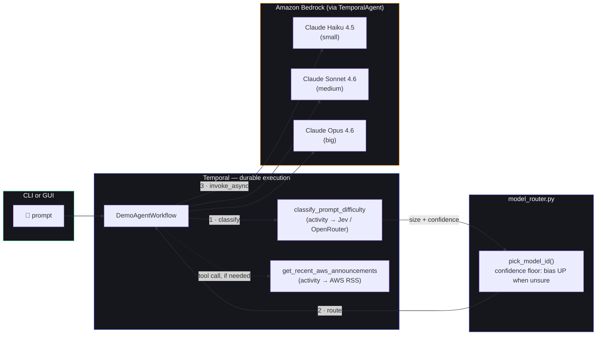

<div align="center">


# Durable Strands Agents

**A Strands AI agent, backed by Amazon Bedrock, running *durably* inside a Temporal workflow —**
**crash the worker mid-run, cut the network mid-call, and it still finishes without redoing work.**

Built for the AWS Community Day Colombo talk on durable AI agents.

[](https://temporal.io)
[](https://aws.amazon.com/bedrock/)
[](https://strandsagents.com)
[](https://typesafe.ai)
[](https://www.python.org)
[](https://docs.astral.sh/uv/)
[](#tests)

</div>

---

## What this is

Every prompt runs inside a single `DemoAgentWorkflow` — a Temporal workflow wrapping a Strands
`TemporalAgent`. Two things make it worth watching on stage:

- 🧠 **Jev-routed models** — [Jev](https://typesafe.ai) (TypeSafe's semantic classifier, called
  over OpenRouter) classifies each prompt as `small` / `medium` / `big` *before* the agent runs,
  and a deterministic policy resolves that to one of three Bedrock models. A trivial "hi" never
  pays Opus prices; a genuinely hard design question never gets shortchanged by Haiku.
- 💪 **Durable by construction** — kill the worker mid-run, restart it, and Temporal resumes
  exactly where it left off. Cut the network mid-call (a real kill-switch proxy, not a mock) and
  the workflow retries until it's restored — no lost work, no re-classification, no re-billing
  for a partial run.

<table>
<tr>
<td align="center" width="33%"><br/><sub>Idle console</sub></td>
<td align="center" width="33%"><br/><sub>Completed run &middot; live step feed</sub></td>
<td align="center" width="33%"><br/><sub>Network kill switch mid-outage</sub></td>
</tr>
</table>

## How a prompt actually flows



A **kill-switch proxy** (`proxy.py`) sits in front of both Bedrock and the AWS feed, so the
network-outage demo can sever either service independently — including tunnels already open —
without touching the worker process.

## The three tiers

| Jev label | Bedrock model | When it's picked |
|---|---|---|
| 🟢 `small` | Claude Haiku 4.5 | Greetings, quick facts, one-line rewrites |
| 🔵 `medium` | Claude Sonnet 4.6 | Everyday reasoning, explanations, routine coding |
| 🔴 `big` | Claude Opus 4.6 | Multi-step reasoning, tricky design, deep analysis — **also the safe fallback** if Jev's confidence is low or Jev itself is unreachable |

Jev only classifies — the label→model mapping and the confidence-floor safety net live in
plain, unit-tested Python (`model_router.py`), never inside the classifier itself.

## Run it

```bash
uv sync
cp .env.example .env   # AWS_REGION / credentials / OPENROUTER_API_KEY

temporal server start-dev                                          # terminal 1
uv run --env-file .env web.py                                      # terminal 2 — http://localhost:8090
HTTPS_PROXY=http://127.0.0.1:8899 \
HTTP_PROXY=http://127.0.0.1:8899 uv run --env-file .env worker.py  # terminal 3
```

> [!IMPORTANT]
> `--env-file .env` is required — `uv run` does **not** load `.env` on its own. Without it,
> `OPENROUTER_API_KEY` never gets set, every prompt's Jev classification fails over to the safe
> default, and every run silently uses the biggest (priciest) model regardless of actual
> difficulty.

Or skip the GUI and use the CLI:

```bash
uv run --env-file .env cli.py "What's new in Bedrock?"
```

Requires Bedrock model access enabled in your AWS account/region, and an OpenRouter API key
for Jev — get one at [openrouter.ai/keys](https://openrouter.ai/keys).

## Demo the durability

- 🔌 **Worker crash** — send a prompt, `Ctrl+C` the worker mid-run, restart it with the same env
  vars. The workflow resumes instead of starting over.
- 🌐 **Network outage** — click **Network** in the GUI, hit **Cut network** mid-run, watch it
  retry, then **Restore network**. It completes without touching the worker at all.
- 🎯 **Model routing** — try a greeting, a routine coding question, and a deliberately hard
  multi-step design prompt back to back. Watch the tier badge move `small → medium → big` and
  the reasoning quality scale with it.

## Tests

```bash
uv run pytest
```

25 tests, fully offline — no real Temporal, Bedrock, or OpenRouter calls. Covers the logic this
repo owns (`proxy.py` policy, `activities.py` parsing/classification, `model_router.py`'s
routing + confidence-floor policy, the `ProgressHook`/routing pieces of `agent_workflow.py`).
There's deliberately no full workflow-replay test — see [`CLAUDE.md`](CLAUDE.md) for why.

(Or `source .venv/bin/activate` once per shell, then plain `pytest` works too — without that,
a bare `pytest` uses your global Python and fails with `ModuleNotFoundError` for this
project's deps.)

## Files

| File | What |
|---|---|
| `agent_workflow.py` | The Temporal workflow + `TemporalAgent`, model routing, progress hook |
| `model_router.py` | Pure size→model policy: the confidence floor that biases up when unsure |
| `activities.py` | Jev-based difficulty classifier + the AWS "What's New" RSS tool |
| `worker.py` | Registers the workflow/activities, wires Bedrock (all 3 tiers) through the proxy if set |
| `web.py` | FastAPI GUI backend + embedded network kill-switch proxy |
| `proxy.py` | The kill-switch: a tiny HTTP CONNECT proxy, no TLS termination |
| `cli.py` | One-shot CLI alternative to the GUI |

See [`CLAUDE.md`](CLAUDE.md) for how the pieces fit together and the gotchas that aren't
obvious from the code.

## Credits

Model-routing pattern inspired by
[mikegc-aws/jev-strands-video](https://github.com/mikegc-aws/jev-strands-video)'s
`model_switching` demo — same "Jev classifies, plain Python decides" split, adapted here for a
one-shot durable workflow instead of a long-lived conversation.
