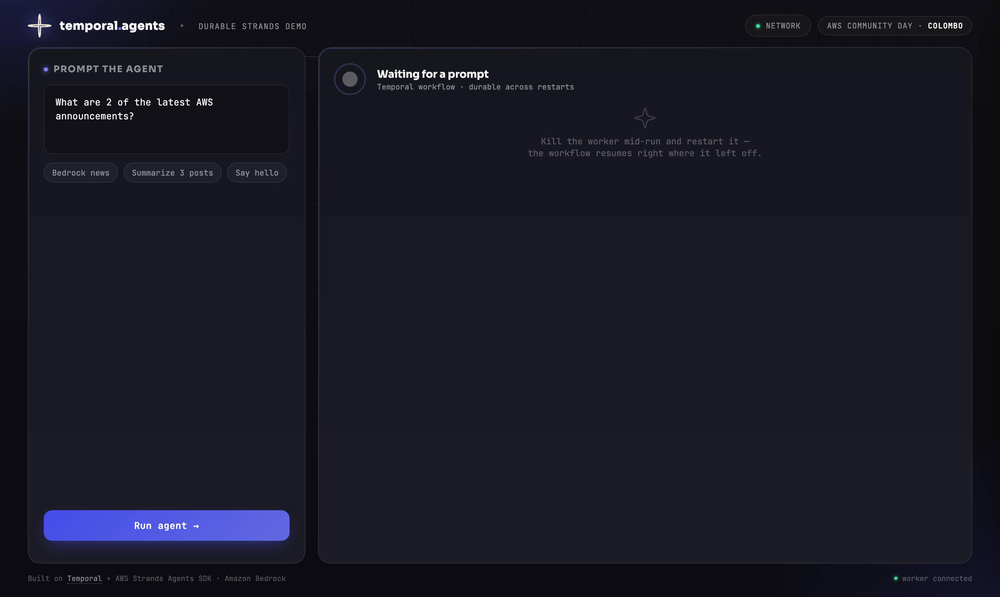
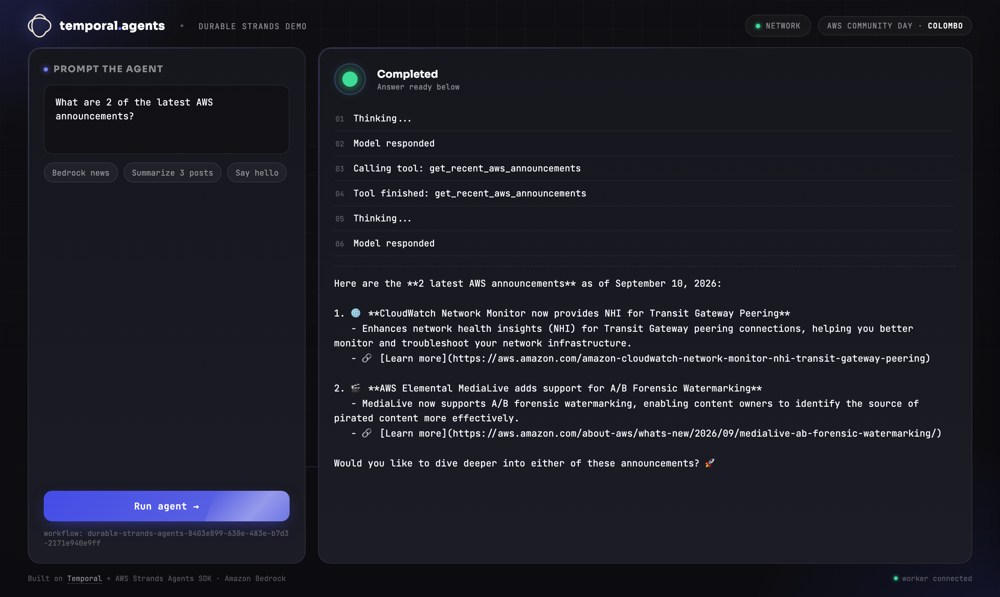
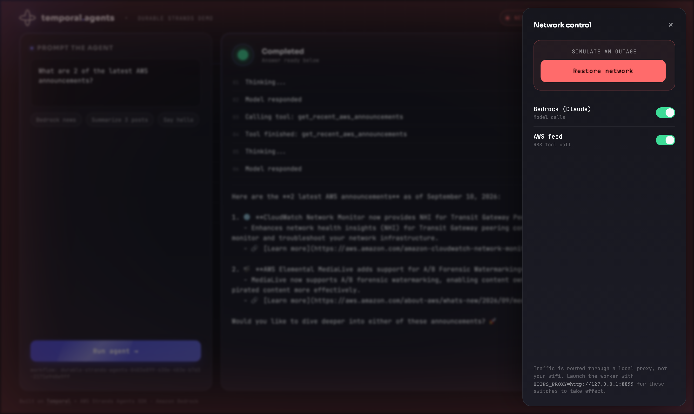

# Durable Strands Agents

A Strands agent backed by Amazon Bedrock, running inside a Temporal workflow — durable across
worker crashes and network outages. Built for the AWS Community Day Colombo talk on durable
AI agents. CLI + web GUI, both talk to the same workflow.





## Run it

```bash
uv sync
cp .env.example .env   # AWS_REGION / credentials / OPENROUTER_API_KEY

temporal server start-dev                                          # terminal 1
uv run --env-file .env web.py                                      # terminal 2 — http://localhost:8090
HTTPS_PROXY=http://127.0.0.1:8899 \
HTTP_PROXY=http://127.0.0.1:8899 uv run --env-file .env worker.py  # terminal 3
```

`--env-file .env` is required (`uv run` does not load `.env` on its own) — without it,
`OPENROUTER_API_KEY` won't be set, every prompt's Jev classification will fail over to the
safe-default fallback, and every run will silently use the biggest model regardless of actual
difficulty.

Or skip the GUI and use the CLI: `uv run --env-file .env cli.py "What's new in Bedrock?"`

Requires Bedrock model access enabled in your AWS account/region, and an OpenRouter API key
for Jev (get one at [openrouter.ai/keys](https://openrouter.ai/keys)).

## Demo the durability

- **Worker crash**: send a prompt, Ctrl+C the worker mid-run, restart it with the same env
  vars — the workflow resumes instead of starting over.
- **Network outage**: click **Network** in the GUI, hit **Cut network** mid-run, watch it
  retry, then **Restore network** — it completes without touching the worker at all.

## Tests

```bash
uv run pytest
```

(Or `source .venv/bin/activate` once per shell, then plain `pytest` works too — without that,
a bare `pytest` uses your global Python and fails with `ModuleNotFoundError` for this
project's deps.)

## Files

| File | What |
|---|---|
| `agent_workflow.py` | The Temporal workflow + `TemporalAgent` + progress hook |
| `activities.py` | The one tool (AWS "What's New" RSS feed) |
| `worker.py` | Registers the workflow/activity, wires Bedrock through the proxy if set |
| `web.py` | FastAPI GUI backend + embedded network kill-switch proxy |
| `proxy.py` | The kill-switch: a tiny HTTP CONNECT proxy, no TLS termination |
| `cli.py` | One-shot CLI alternative to the GUI |

See `CLAUDE.md` for how the pieces fit together and the gotchas that aren't obvious from the code.
